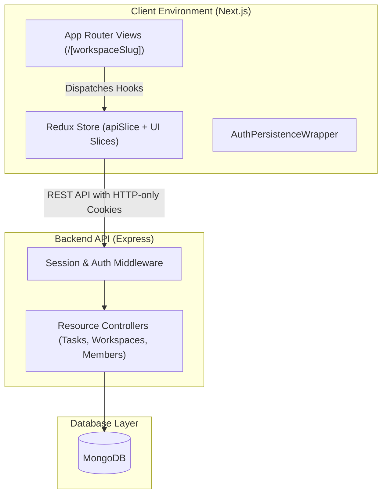
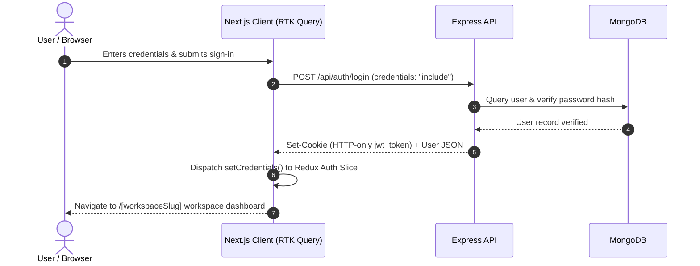
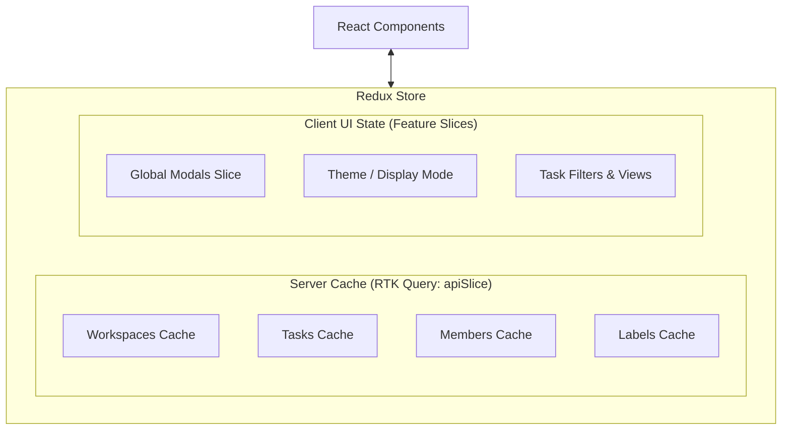
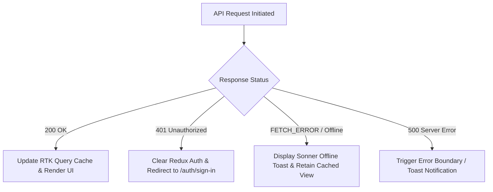

# 🏛 System Architecture & Engineering Specifications

This document outlines the system architecture, authentication lifecycles, state management, error handling, and degradation strategies for the **StackTask** client application.

---

## 1. System Context & Overview

StackTask is built on a decoupled client-server architecture:
- **Client (Frontend)**: Next.js App Router (React 19) rendering interactive workspace views, managing client-side cache and modal states.
- **Backend (API)**: Express.js REST API providing business logic, session validation, and database operations.
- **Persistence**: MongoDB for data storage.

---

## 2. Authentication & Session Lifecycle

The application uses **HTTP-only cookie authentication** for enhanced security against XSS vulnerabilities.

### Route Protection Strategy
- **Client-Side Guarding**: `AuthPersistenceWrapper` checks authentication status and redirects unauthenticated users to `/auth/sign-in`.
- **API Guarding**: Every backend endpoint verifies the session cookie attached via `credentials: "include"`.

---

## 3. State Management & Cache Architecture

The application adopts a strict separation between **Server State** and **Client UI State**.

### Cache Invalidation Tags
RTK Query utilizes `tagTypes` to keep data synchronized:
- `Workspace`: Invalidates when workspaces are created, updated, or deleted.
- `Tasks`: Invalidates when task status, priorities, or details are modified.
- `Members`: Invalidates when invitations are accepted or members removed.
- `Labels`: Invalidates when task labels are created or updated.

---

## 4. Error Handling & Graceful Degradation

### Resilience Protocols:
1. **Network Disruption**: Handled via `FETCH_ERROR` interceptor in `apiSlice` providing clear connectivity feedback.
2. **Session Expiration**: Centralized 401 interception invalidates client auth state and triggers login redirection without broken render states.
3. **Partial UI Degradation**: Secondary queries (e.g. notifications, user activity) fail without breaking primary task board views.
4. **Optimistic Updates**: Task actions (e.g. toggles, priority adjustments) can update local state immediately and rollback on mutation errors.
