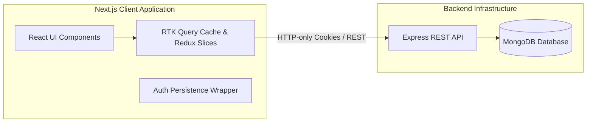

# StackTask

> A high-performance, task and project management workspace inspired by Linear. Built with Next.js (App Router), Redux Toolkit Query, and Tailwind CSS.

---

## Features

- **Linear-Style Workspace**: Fluid navigation with minimal friction and instant UI response.
- **Real-Time Synchronized State**: Optimized data fetching, caching, and invalidation powered by Redux Toolkit Query.
- **Secure Session Management**: HTTP-only cookie-based authentication with seamless background persistence.
- **Sleek Aesthetic & Dark Mode**: Tailored dark palettes, custom modal managers, and micro-interactions built with Tailwind CSS & Framer Motion.
- **Workspace Collaboration**: Dynamic multi-workspace routing (`/[workspaceSlug]`), task categorization, labels, and member management.

---

## 🛠 Tech Stack

| Layer | Technology |
| :--- | :--- |
| **Framework** | [Next.js](https://nextjs.org/) (App Router, React 19) |
| **Language** | [TypeScript](https://www.typescriptlang.org/) |
| **Styling** | [Tailwind CSS](https://tailwindcss.com/), [Headless UI](https://headlessui.com/), [Framer Motion](https://www.framer.com/motion/) |
| **State & Cache** | [Redux Toolkit](https://redux-toolkit.js.org/) (RTK Query & Slices) |
| **UI Primitives** | [Sonner](https://sonner.emilkowal.ski/) (Toaster), [Lucide React Icons](https://lucide.dev/) |
| **Analytics** | [PostHog](https://posthog.com/), [DataFast](https://datafast.io/) |
| **Backend API** | Node.js, Express, MongoDB (REST API) |

---

## 🏗 High-Level Architecture



For detailed system design, sequence diagrams, and resilience strategies, see [ARCHITECTURE.md](./ARCHITECTURE.md).

---

## 🚀 Getting Started

### 1. Prerequisites
- **Node.js**: >= 18.x
- **npm** / **yarn** / **pnpm**

### 2. Installation
```bash
# Clone the repository
git clone https://github.com/your-username/task-manager.git

# Navigate into the project folder
cd task-manager

# Install dependencies
npm install
```

### 3. Environment Configuration
Create a `.env.local` file in the root of the project:

```env
# Backend API Base URL
NEXT_PUBLIC_API_BASE_URL="http://localhost:4000"

# Analytics (Optional)
NEXT_PUBLIC_POSTHOG_KEY="your_posthog_key"
NEXT_PUBLIC_POSTHOG_HOST="https://us.i.posthog.com"
```

### 4. Run Development Server
```bash
npm run dev
```

Open [http://localhost:3000](http://localhost:3000) with your browser.

---

## 📂 Project Structure

```text
src/
├── app/                  # Next.js App Router routes & layouts
│   ├── (root)/
│   │   ├── [workspaceSlug]/  # Dynamic workspace routes (tasks, settings, profile)
│   │   ├── auth/             # Sign-in, Sign-up, Verification
│   │   └── workspaces/       # Workspace selector and onboarding
│   ├── layout.tsx        # Root HTML layout
│   └── Initializers.tsx  # Global providers, analytics & sonner toast
├── components/           # UI Components
│   ├── reuseables/       # Dropdowns, Modals, Forms, Buttons
│   └── ui/               # Primitives & styling utilities
├── config/               # App configuration & environment constants
├── hooks/                # Custom React & RTK Query hooks
├── lib/                  # Persistence wrappers & utility helpers
├── redux/                # Redux Toolkit store, apiSlice & feature slices
├── types/                # TypeScript interfaces & types
└── utils/                # Toast notifications, storage helpers, formatters
```

---

## 📜 Scripts

| Command | Description |
| :--- | :--- |
| `npm run dev` | Starts local Next.js development server |
| `npm run build` | Builds production-optimized bundle |
| `npm run start` | Runs the production build server |
| `npm run lint` | Runs ESLint checks across the codebase |

---

## 📄 License

This project is private and proprietary.
